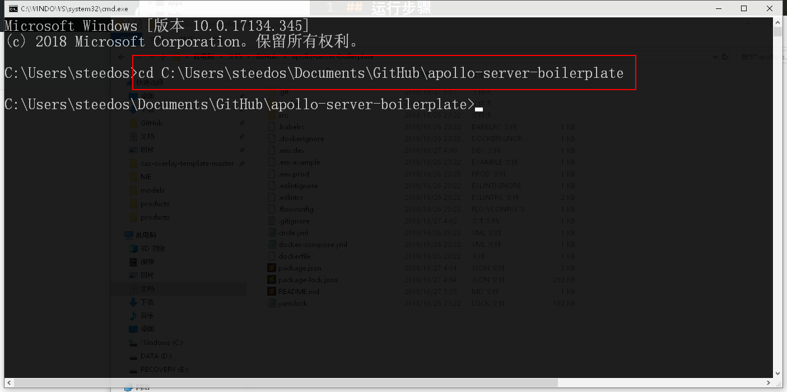
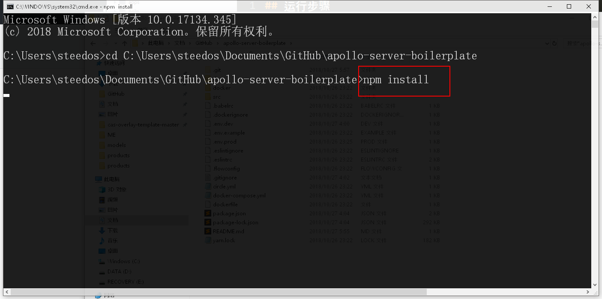
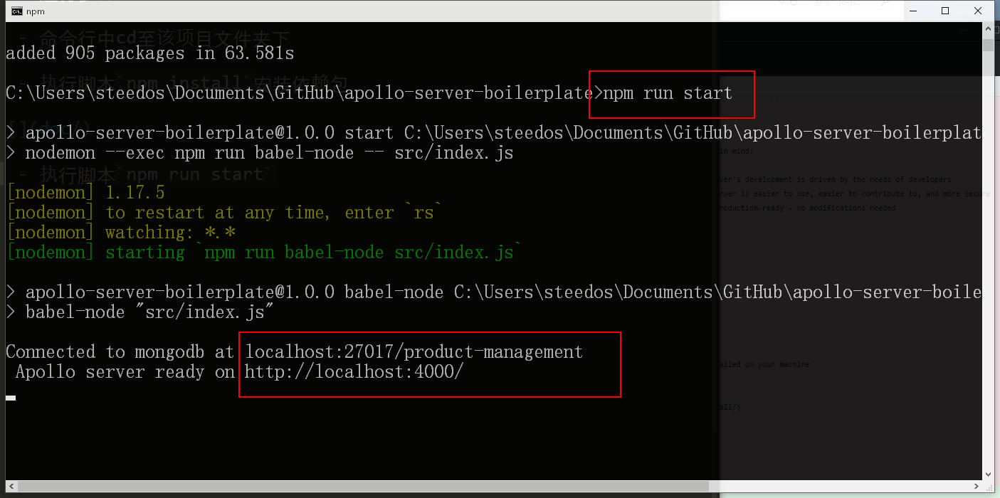
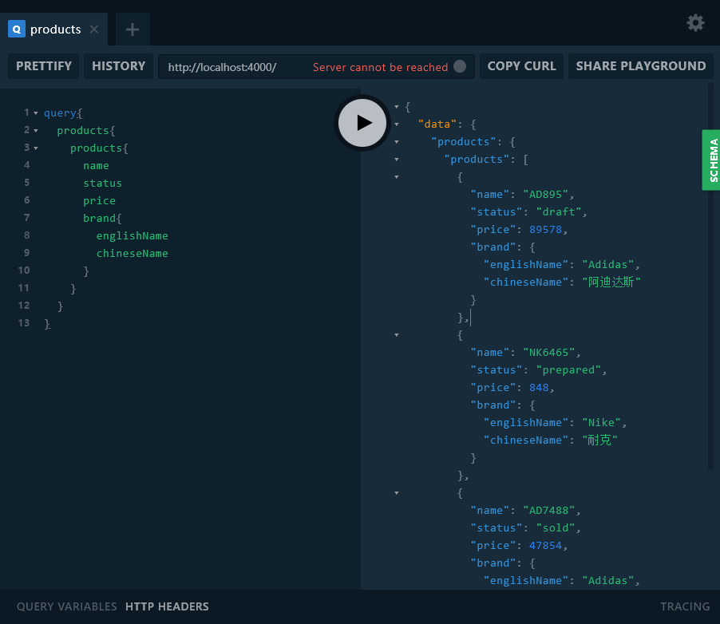

## 运行步骤

- 命令行中cd至该项目文件夹下



- 执行脚本`npm install`安装依赖包



- 执行脚本`npm run start`启动项目



- 打开浏览器，访问`http://localhost:4000/`

- 输入查询

```json
query{
  products{
    products{
      name
      status
      price
      brand{
        englishName
        chineseName
      }
    }
  }
}
```

 
